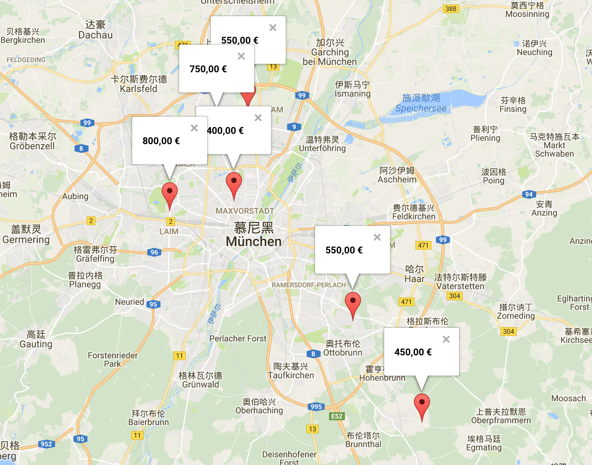

# Renting Tool for Munich

A housing location visualization tool for Munich.

> This repository is still in developing, please feel free to submit an [issue](https://github.com/changkun/munich-housing-tool/issues) or pull a [request](https://github.com/changkun/munich-housing-tool/pulls) if you have any new idea or requirements.

## Motivation

It's generally known that renting in Munich is a huge probelm for everyone. As a fresh student, we can not afford such high rents over than 600 Euro if we do not applied a student domitory.

The **Studentenwerk Muenchen** provides Housing Referral Service, which has a loads of housing informations. However, unfortunately, their information lists in a table and quite difficult to use for us. 

Thus, a convenient renting tool becomes a necessity.

## Demo



## Usage

### `housing-spider.py`

`housing-spider.py` is a simple spider to download housing infomations from **Studentenwerk Muenchen**, just simply run:

```bash
python housing-spider.py
```

Then you should get a `.csv` file in this folder, which contains all the housing informations provided by Studentenwerk Muenchen.

### `index.html`

Once you have the `rent.csv` file, you should be able to use `index.html` to visualize all the informations in a map that allows you to check all the housing infos quickly and intuitional.

For usage, just simply choose the `.csv` file in the web page, then you will get all you need.


## License

This repository is under the [MIT license](LICENSE), you must read license details before you use it.